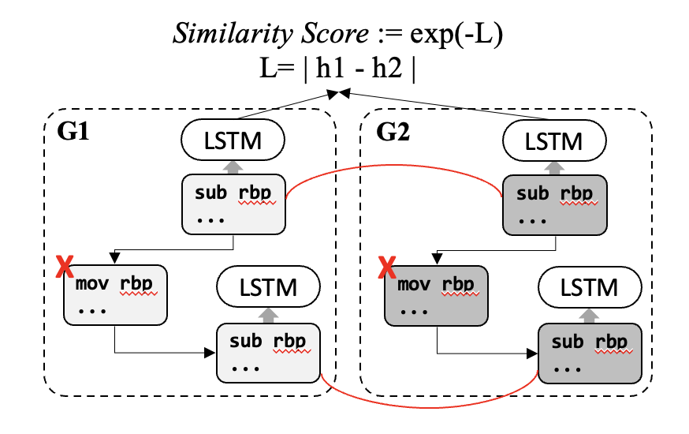

# InnerEye
This repository implements *InnerEye*, LSTM-based cross-platform binary code embedding generating tool that appears in the following paper.
```
@inproceedings{zuo2019neural,
title={Neural Machine Translation Inspired Binary Code Similarity Comparison beyond Function Pairs},
author={Zuo, Fei and Li, Xiaopeng and Young, Patrick and Luo,Lannan and Zeng,Qiang and Zhang, Zhexin},
booktitle={Proceedings of the 2019 Network and Distributed Systems Security Symposium (NDSS)},
year={2019} }
```

The main purpose of this implementation is for providing a baseline for cross-platform binary code embedding research and the experiment results appeared in [Improving Cross-Platform Binary Analysis using Representation Learning via Graph Alignment](https://github.com/yonsei-cysec/XBA).

## Getting Started
Our implementation is mostly based on the [official implementation](https://github.com/nmt4binaries/nmt4binaries.github.io/tree/master/download) of the author of the paper while we apply the model to our cross-platform datasets that cover a broad range of software diciplines; SQLite3 (database), OpenSSL (network), cURL (file transfer), Httpd (webserver), libcrypto (crypto library), glibc (standard library). The data is preprocessed following the scheme described in the original paper and stored in `data` directory that is structured in the same way with [XBA](https://github.com/yonsei-cysec/XBA). Other components are structured as follows.

    .
    ├── README
    ├── Pipfile                 # Manages a Python virtualenv.
    ├── Pipfile.lock            # Manages a Python virtualenv (Do not touch).
    ├── extract.py             # 
    ├── train.py             #  
    ├── utils.py             #  
    ├── validation.py             #  
    ├── data             # 
    ├── embeddings             # 
    ├── weights             # 

### Install 
#### Prerequisites
Python 3.8 or above version is required. To install python dependencies, you need to install pipenv first.
```shellsciprt
$ pip3 install pipenv
```

#### Use pipenv shell

Install dependencies
```shellscript
$ pipenv install
```

Activate pipenv shell
```shellscript
$ pipenv shell
```

#### Use your own python virtual environment

Extract requirements.txt
```shellscript
$ pipenv lock -r > requirements.txt
```

Install dependencies
```shellscript
$ pip install -r requirements.txt
```

## How to run
A several desired sequences of executable are defined in the `Makefile`. 

Training Instruction2vec (i2v) embeddings and Siamese-LSTM from data in `/revos/data/done/${programs}/innereye.csv` 
```shellscript
$ pipenv run -- python train.py --targets={programs}
```

Test the trained model
```shellscript
$ pipenv run -- python validation.py
```

Extract basic block embeddings using a model trained on {programs}
```shellscript
$ pipenv run -- python extract.py --targets={programs}
```
